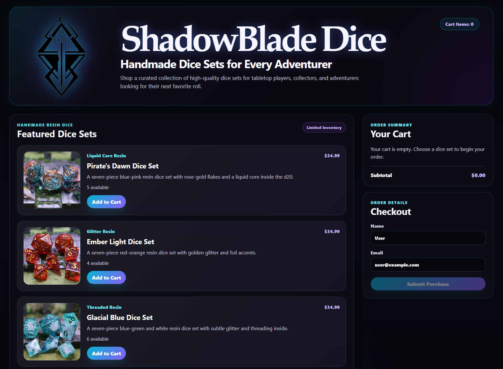

# ShadowBlade Dice Shop

ShadowBlade Dice Shop is a full-stack e-commerce demo built for a handmade dice shop concept. The project features a React and Vite frontend, an Express backend API, product inventory, cart functionality, and a demo checkout flow.

This project was created as part of my software development learning journey and is designed to demonstrate frontend structure, API communication, state management, responsive design, and full-stack project organization.

## Preview

<p align="center">
  
</p>

## Live Demo

https://morganneedham.github.io/shop/

> Note: The live GitHub Pages version uses demo data because GitHub Pages only hosts static frontend files. The local development version connects to the Express backend.

## GitHub Repository

https://github.com/MorganNeedham/shop

## Features

* Responsive React frontend built with Vite
* Express backend API for product data and purchase submission
* Product catalog with images, prices, descriptions, and inventory
* Shopping cart with quantity controls and subtotal calculation
* Demo checkout form
* Order confirmation / thank-you screen
* Custom dark fantasy-inspired styling
* Mobile-friendly layout
* GitHub Pages deployment setup for the frontend

## Tech Stack

### Frontend

* React
* Vite
* JavaScript
* CSS
* HTML

### Backend

* Node.js
* Express
* CORS
* Morgan

### Tools

* Git
* GitHub
* VS Code
* GitHub Pages

## Project Structure

```text
shop
├── client
│   ├── public
│   │   └── images
│   ├── src
│   │   ├── api
│   │   ├── components
│   │   ├── App.jsx
│   │   └── main.jsx
│   ├── package.json
│   └── vite.config.js
├── server
│   ├── server.js
│   └── package.json
├── .github
│   └── workflows
│       └── deploy-client.yml
└── README.md
```

## Local Development

This project uses two separate development servers: one for the frontend and one for the backend.

### 1. Start the backend server

```bash
cd server
npm install
npm run dev
```

The backend runs at:

```text
http://localhost:4000
```

API endpoint:

```text
http://localhost:4000/api/products
```

### 2. Start the frontend

Open a second terminal:

```bash
cd client
npm install
npm run dev
```

The frontend runs at:

```text
http://localhost:5173
```

## Demo Checkout Note

The checkout flow is a portfolio demo. No real payment is processed. Submitting an order updates the demo inventory and displays a confirmation screen.

## What I Learned

While building this project, I practiced:

* Creating reusable React components
* Managing state with React hooks
* Passing props between components
* Fetching data from an Express API
* Handling loading and error states
* Building cart and checkout logic
* Structuring a full-stack project
* Styling a responsive interface with custom CSS
* Preparing a project for GitHub and portfolio presentation

## Future Improvements

Possible future updates include:

* Deploying the Express backend to a hosting service
* Connecting the frontend to a live API instead of demo data
* Adding persistent database storage
* Adding product detail pages
* Adding image galleries for each dice set
* Improving accessibility and keyboard navigation
* Adding automated tests
* Creating an admin view for managing inventory

## About This Project

ShadowBlade Dice Shop is not currently an active business. It is a software development portfolio project based on a handmade dice shop concept. The goal of the project is to demonstrate practical frontend and backend development skills in a realistic e-commerce-style application.
